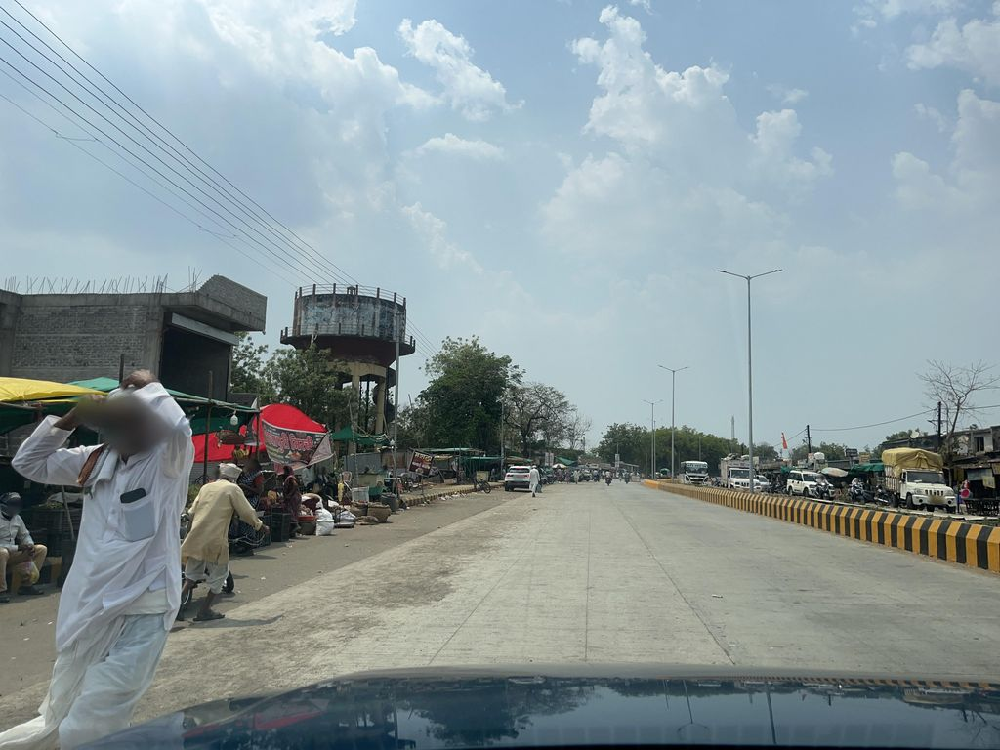
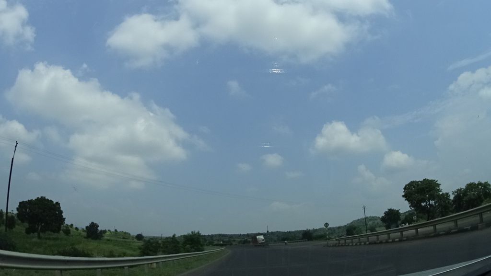
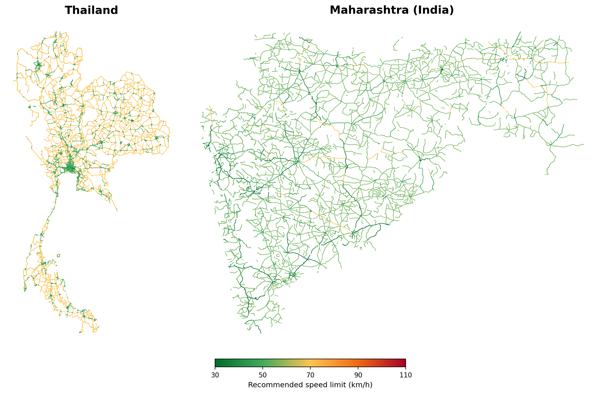

# Speed Safety Atlas: Scalable AI for Evidence-Based Speed-Limit Review

**UNSW Sydney · ADB AI for Safer Roads Innovation Challenge 2026**

Released under the [MIT License](LICENSE).

This work answers the challenge question directly on **where the posted speed limits are misaligned with road function and vulnerable road user (VRU) exposure?** The focus is not on whether drivers are speeding, but on whether the posted limit itself is appropriate for the road environment, particularly where pedestrians and cyclists are present. The goal is to support evidence-based speed-limit reviews across Asia and the Pacific.


## Method

The method is deliberately simple, scalable, and auditable. For every road link, we do five things:

1. **Classify the road context** from road function and land use, then **refine it with street
   imagery** where available, a vision-language model (OpenAI Chat GPT5.5) reads the Mapillary photo, and its reading
   is kept in its own columns alongside the supplied data rather than overwriting it. This directly
   addresses the challenge's caution that the `LandUse` and `SpeedLimit` fields are estimates.
2. **Assign the appropriate Safe-System maximum** for that context, from a cited reference table:

   | Road context | Appropriate maximum speed |
   |---|---|
   | Pedestrians and cyclists mixing with traffic | **30 km/h** |
   | Urban, likely VRU presence, at-grade intersections | **50 km/h** |
   | Rural undivided (head-on/run-off risk) | **70 km/h** |
   | Divided/limited-access motorway, no VRU exposure | **100–110 km/h** |

3. **Recommend a reduction only.** The recommended limit is the lower of the posted limit and the
   Safe-System maximum; the method never raises a limit.
4. **Calculate the misalignment** — the difference between the current posted limit and the
   recommended limit, i.e. how many km/h the limit should come down.
5. **Flag the highest-risk links.** A link is marked High where the current limit is materially too
   high for a vulnerable-road-user context and the observed 85th-percentile operating speed confirms
   that the risk is present on the road.

The result is a practical, transparent recommendation for each link — a proposed limit, the size of
the misalignment, and a risk flag. It is designed to be understood by a non-technical decision-maker
and to scale across cities and countries, using only globally available inputs: road function,
operating speed, land use and street imagery.

**References.**
WHO, [*Speed management: a road safety manual for decision-makers and practitioners* (2nd ed.)](https://www.who.int/publications/m/item/speed-management--a-road-safety-manual-for-decision-makers-and-practitioners.-2nd-edition) ·
OECD/ITF, [*Speed and Crash Risk*](https://www.itf-oecd.org/speed-crash-risk) ·
World Bank GRSF, [*Detecting Urban Clues for Road Safety*](https://documents.worldbank.org/en/publication/documents-reports/documentdetail/099200002152228754).
The street-imagery method adapts [**V-RoAst**](https://github.com/PongNJ/V-RoAst), which reads
road-safety attributes from street imagery using vision-language models.

## How the method uses street imagery
The vision-language model reads each street photo and corrects the road context where the supplied
land-use estimate is wrong — in both directions:

<table>
<tr>
<td width="50%" align="center"></td>
<td width="50%" align="center"></td>
</tr>
<tr>
<td>Data labels this road <b>rural</b>, but the photo shows pedestrians and cyclists mixing with traffic → reclassified to <b>30 km/h</b> and flagged <b>High</b> risk.</td>
<td>Another <b>rural</b>-labelled road is in fact a <b>divided, limited-access</b> road → kept in the <b>100 km/h</b> band and cleared.</td>
</tr>
</table>

*Street imagery © [@Absawant](https://www.mapillary.com/app/?pKey=1447251907128939) (left) and [@geohacker](https://www.mapillary.com/app/?pKey=187713106534818) (right), via Mapillary, licensed [CC BY-SA 4.0](https://creativecommons.org/licenses/by-sa/4.0/).*

## Results
<p align="center"></p>

*Recommended (proposed) speed limits per road link across the two study areas. Colour is the
Safe-System-appropriate limit (green 30 → red 110 km/h); the method only lowers a limit, never
raises it. In Thailand about nine in ten links are recommended for a reduction; in Maharashtra the
posted limits are already broadly aligned. Network © OpenStreetMap / Overture.*

## Repository layout
```
model/                       data preparation + VLM imagery pipeline
  load.py                    harmonise the two networks (TH + MH)   -> data/harmonised.gpkg
  enrich.py                  add land use + OSM VRU POIs            -> data/enriched.gpkg
  vlm_sample.py              VLM road-context characterisation (gpt-5.5, 2 imgs/seg, resumable):
                               `vlm_sample.py`         random 10% per city
                               `vlm_sample.py target`  targeted misalignment-suspect pass
score/limit_alignment.py     THE METHOD: per-link recommended limit, misalignment, risk flag and
                             current-vs-proposed classification  -> score/limit_alignment.{csv,geojson}
map/                         interactive map (MapLibre)
  index.html                 toggle posted ↔ recommended ↔ risk; current vs proposed classification
  build_alignment_map.py     per-city map layers from the score   -> map/data/align_{region}.geojson
  server.js                  tiny static file server
findings/Findings_Summary.pdf   the 5-page findings report
run_all.sh                   one-command reproduction (load → enrich → score → map layers)
```

## Run
The pipeline reads the challenge-provided dataset (the network, speed and land-use files); set its
location at the top of `model/load.py` if needed. Intermediates are written to `data/` (not in this
repo). With the dataset in place:

```bash
./run_all.sh        # load → enrich → score → per-city map layers
node map/server.js  # serve the interactive map at http://localhost:8731

# Optional street-imagery refinement (needs MAPILLARY + OPENAI keys in .env):
python model/vlm_sample.py          # random 10% per city, resumable
python model/vlm_sample.py target   # targeted pass on misalignment-suspect links
python score/limit_alignment.py     # re-score with the imagery refinement
python map/build_alignment_map.py   # refresh the map layers
```
Live map: **https://meeadsaberi.github.io/speed-limit-alignment/map/**

## Data note
The raw input network and the per-link score **CSV** carry
**TomTom-derived** operating speeds (commercial, challenge-provided) and are **not** included here —
they are provided by ADB through the submission platform. The published per-city map GeoJSON
includes an 85th-percentile operating-speed field (a derived aggregate) so the interactive map
renders; raw probe data is not redistributed. `./run_all.sh` over the challenge dataset
reproduces the score and map layers locally.

## Honesty notes
- VLM imagery refines context where Mapillary coverage exists (Thailand ~77%, Maharashtra ~22%);
  elsewhere a transparent **data-prior** (class + land use) is used, flagged per link.
- The method only recommends **reductions**; it never raises a limit.
- No crash data is used or required — a *proactive* Safe-System appropriateness screen, not a
  crash-prediction model.

## Attribution
Network © OpenStreetMap contributors, Overture Maps Foundation · speeds: TomTom
(challenge-provided) · imagery © Mapillary.
